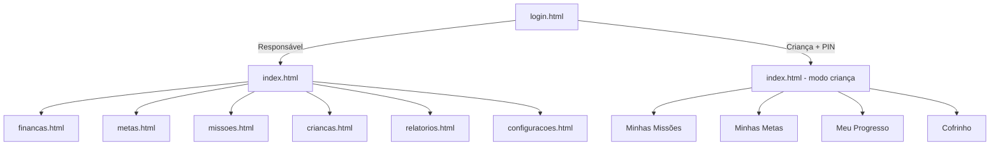

# Fluxo de telas

```mermaid
flowchart TD
  L[login.html] -->|Responsável| D[index.html]
  L -->|Criança + PIN| CD[index.html - modo criança]
  D --> F[financas.html]
  D --> M[metas.html]
  D --> MI[missoes.html]
  D --> C[criancas.html]
  D --> R[relatorios.html]
  D --> S[configuracoes.html]
  CD --> CM[Minhas Missões]
  CD --> CG[Minhas Metas]
  CD --> CP[Meu Progresso]
  CD --> CF[Cofrinho]
```

O perfil infantil permanece em `index.html` para preservar a estrutura de oito páginas do protótipo e, ao mesmo tempo, separar a experiência por perfil.
